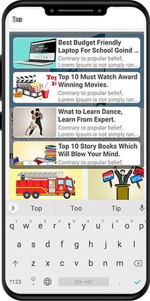

# Full Stack News App With React Native and Node JS

## Introduction

This is a full stack news app project created for YouTube tutorial by [non-degree programmer](https://www.youtube.com/channel/UCiTUxayvzwCn9qStZYK07zg). To run this project first you need to setup your [backend-api](https://github.com/ndpniraj/node-js-news-app-backend).

## How to run this project

- First clone or download [backend-api](https://github.com/ndpniraj/node-js-news-app-backend)
- Second clone or download [react-native-news-app](https://github.com/ndpniraj/react-native-news-app)
- Do npm install on both of this project.
- After change the IP address on the backend-api, also you can watch [this video](https://www.youtube.com/watch?v=JrUoMfBouww).

If you want to see how you can make this project on your own then you can whtch these video series.

- Creating Backend API with Node JS [YouTube](https://www.youtube.com/watch?v=FljcYOOaf7s&list=PLaAoUJDWH9Wrnp5VbwZlH4rR1F5CHGQLL).
- Creating Front End With React Native [YouTube](https://www.youtube.com/watch?v=Q_Sk6YL_eh4&list=PLaAoUJDWH9WoYJY52F52Erq_GJIa4hc3e).
